# 📋 Smart Attend

A console-based student attendance management system built in **C** using **structures** and **file handling**.

This project was developed to simplify attendance management by providing separate interfaces for teachers and students. Teachers can manage student records and attendance, while students can log in to view their attendance statistics and reports.

---

## Features

### 👨‍🏫 Teacher Features
- Teacher login authentication
- Add new students
- Update student records
- Search for students by roll number
- Mark attendance
- View attendance summaries
- Generate attendance reports

### 👨‍🎓 Student Features
- Student login authentication
- View personal attendance records
- Check attendance percentage
- Access attendance summary

---

## Concepts Used

- Structures
- Functions
- File Handling
- Authentication System
- Menu Driven Programming
- Arrays and Strings

---

## Files Used

### `students.txt`
Stores student information including:
- Roll Number
- Name
- Password

Example:

```text
1 Anukriti anu11
2 Vinayak vinu28
```

### `attendance.txt`
Stores attendance records including:
- Roll Number
- Date
- Attendance Status (P/A)

Example:

```text
1 02-07-2026 P
2 02-07-2026 A
```

---

## Screenshots

### Main Menu
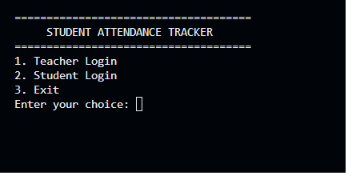

### Teacher Login
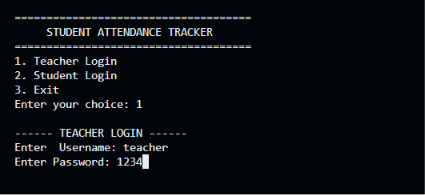

### Teacher Dashboard
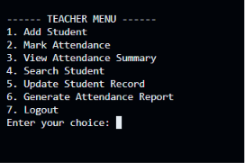

### Add Student
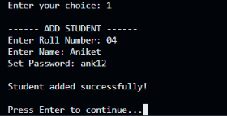

### Update Student
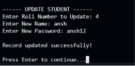

### Mark Attendance
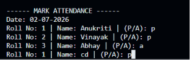

### Search Student
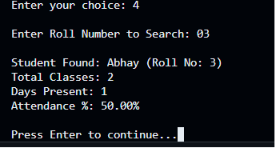

### Attendance Record
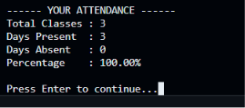

### Attendance Summary
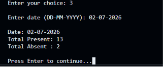

### Student Dashboard
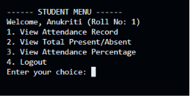

### Attendance Report
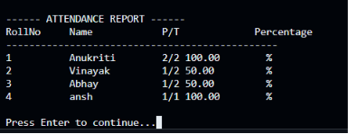

---

## How to Run

Compile the program:

```bash
gcc Smart_Attend.c -o Smart_Attend
```

Run the executable:

```bash
./Smart_Attend
```

---

## Default Teacher Credentials

```text
Username: teacher
Password: 1234
```

---

## Future Improvements

Some features that could be added in future versions:

- Password encryption
- Export attendance reports as CSV files
- Multiple teacher accounts
- Monthly attendance analytics
- GUI version of the application
- Database integration using MySQL

---

## Author

**Anukriti Pandey**

B.Tech Computer Science Engineering Student  
JIIT Noida
